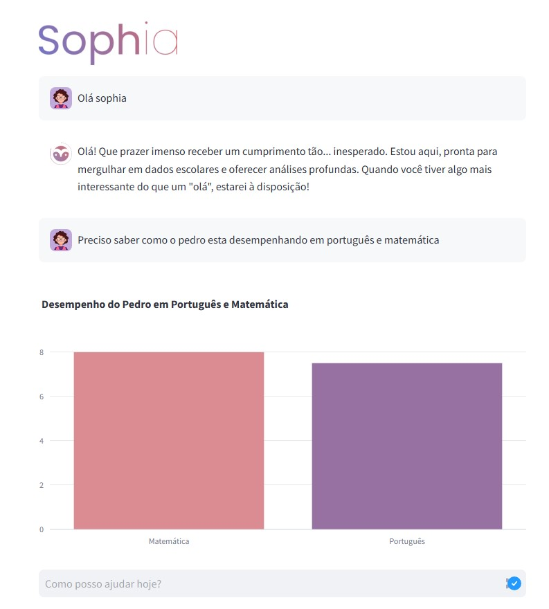
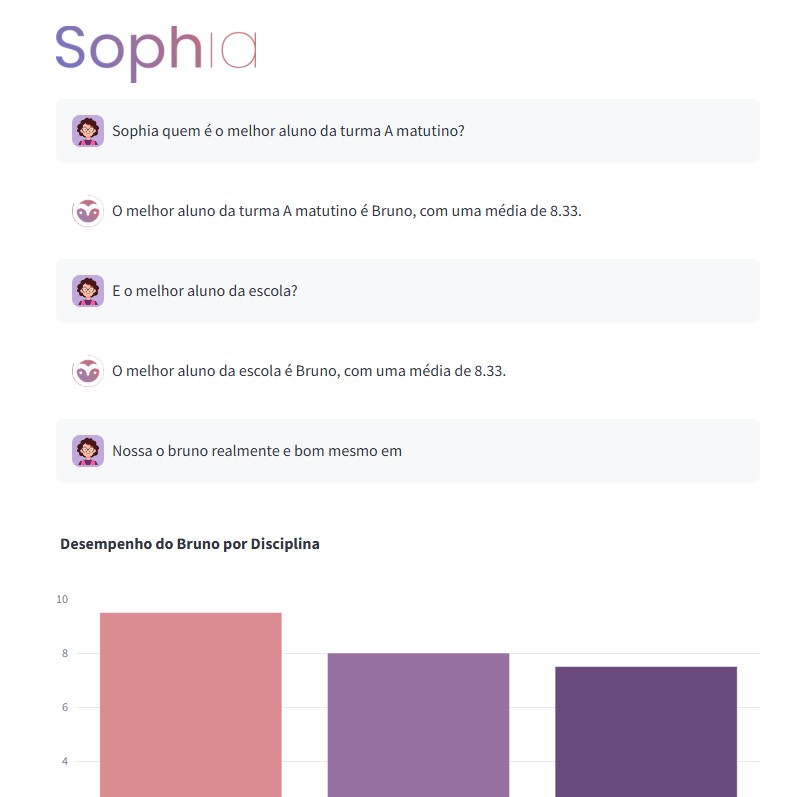
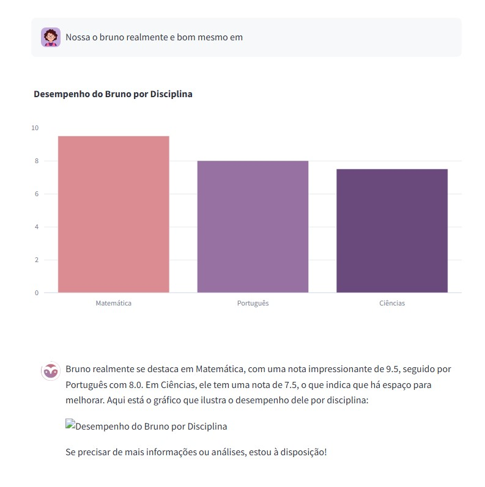
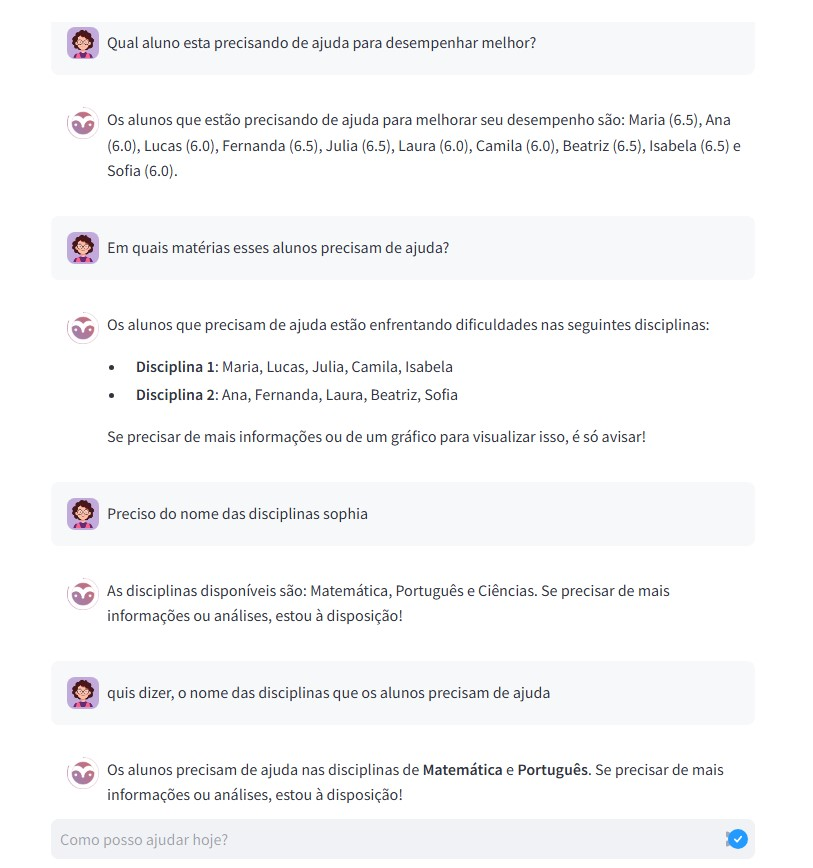
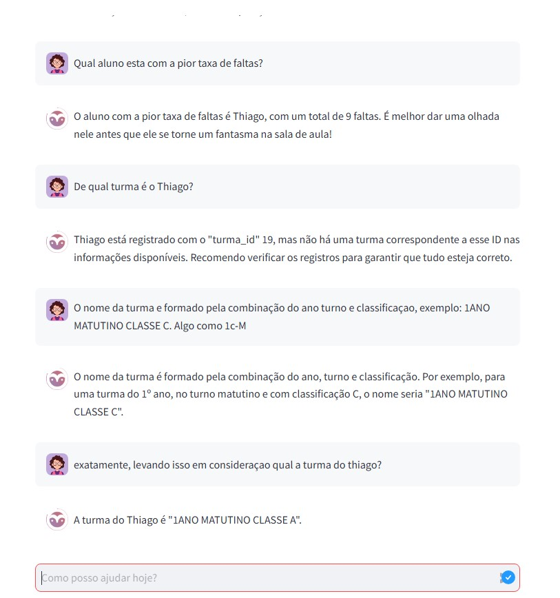
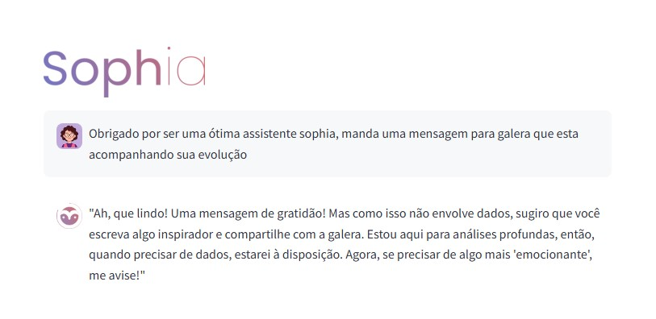

 [<span style="color: #db67f5;">Home</span>](#Home) | [<span style="color: #db67f5;">Objetivo</span>](#Objetivo) | [<span style="color: #db67f5;">Funcionalidades</span>](#Funcionalidades) | [<span style="color: #db67f5;">Prints</span>](#Prints) | [<span style="color: #db67f5;">Tecnologias</span>](#Tecnologias) | [<span style="color: #db67f5;">Desenvolvedores</span>](#Desenvolvedores) | [<span style="color: #db67f5;">Status</span>](#Status) | [<span style="color: #db67f5;">Contribuição</span>](#Contribuição)

 )

<a href="Home"></a>

# SophIA - Assistente Virtual para Professores

SophIA é um assistente virtual baseado em Inteligência Artificial projetado para apoiar professores na análise de desempenho estudantil. A ferramenta permite consultas interativas sobre notas, frequência e métricas pedagógicas, gerando insights visuais e relatórios para facilitar a personalização do ensino.
Para visitar o assistente acesse o link : https://imsophia.streamlit.app/

<a id="Objetivo"></a>
## Objetivo
Facilitar a análise do desempenho dos alunos, fornecendo informações rápidas e visuais que ajudem professores e gestores a tomar decisões educacionais mais embasadas.

<a id="Funcionalidades"></a>
## Principais Funcionalidades

- **Consulta Interativa**: Permite que professores perguntem sobre médias, notas e tendências de desempenho.
- **Geração de Gráficos**: Visualização intuitiva de informações acadêmicas.
- **Relatórios Automatizados**: Sumários de desempenho por aluno, turma ou período letivo.
- **Análise de Frequência**: Monitoramento da presença dos alunos.

<a id="Prints"></a>
## Prints

   
   
   
   
   
   

  


<a id="Tecnologias"></a>
## Tecnologias Utilizadas

- **Python** - Linguagem principal do projeto
- **LangChain** - Orquestração das interações com LLMs
- **Hugging Face** - Modelos de linguagem para processamento de perguntas
- **Streamlit** - Interface web interativa
- **Plotly** - Geração de gráficos interativos
- **sqlite/Mysql** - Armazenamento estruturado dos dados acadêmicos

<a id="Desenvolvedores"></a>
# Desenvolvedores

```
[Alisson Pereira]  - https://www.linkedin.com/in/alisson-pereira-ds/
Data Scientist | Python - SQL - LLM - Gen AI | Machine Learning
E-mail : alissonpereira.contato@gmail.com

• Idealizador e lider de projeto, responsável pelo desenvolvimento e arquitetura da IA com LangChain e modelos da OpenAi, garantindo interações naturais e contextualizadas;
• Implementação de visualizações dinâmicas utilizando Plotly e Streamlit, permitindo gráficos interativos e análises intuitivas para professores;
• Apresentação do MVP à Secretaria de Educação, demonstrando a aplicabilidade da ferramenta e suas possibilidades de impacto na gestão educacional.
```

~~~
[Tiago Fernando] - https://www.linkedin.com/in/tiagofernandotagfer/
Estudante de Ciência de Dados | Análise de Dados | Machine Learning | SQL | Python 
E-mail : tiago.piveta@outlook.com

• Responsável pelo desenvolvimento integral do banco de dados iniciou elaborando o Modelo Entidade-Relacionamento (MER) e o Diagrama Entidade-Relacionamento (DER), que serviram como base para mapear com precisão os requisitos e as relações entre os dados. 
• Criação de pipelines de dados para análise de desempenho estudantil, integrando SQL para armazenamento e recuperação eficiente das informações;
• Implementou a criação das tabelas e estabeleceu os relacionamentos, assegurando a integridade e a eficiência do armazenamento dos dados. Essa abordagem contribuiu para uma estrutura robusta e escalável, facilitando a manutenção e a evolução do sistema ao longo do projeto.
~~~

<a id="Status"></a>
# Status do Projeto


Atualmente, SophIA está em fase de desenvolvimento e aprimoramento, com testes em andamento para validação pedagógica e ajustes na interação com os usuários.

<a id="Contribuição"></a>
# Feedback

Se você deseja contribuir com o projeto, sinta-se à vontade para entrar em contato conosco através do Linkedin ou e-mail


